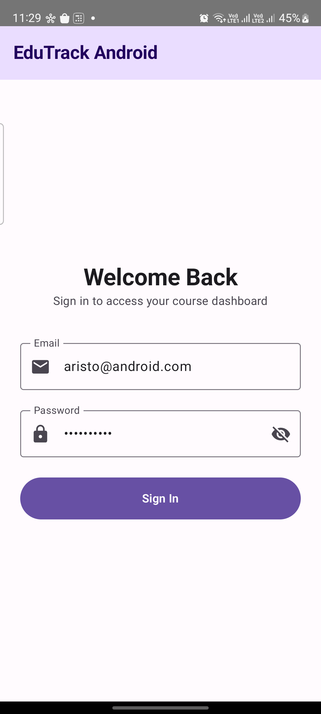
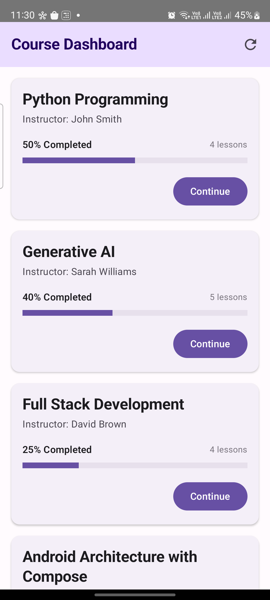
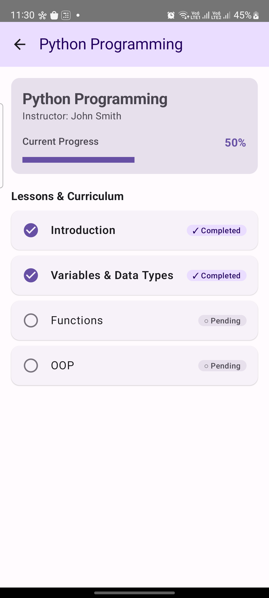

# Learning Dashboard (Android / Jetpack Compose)
Senior Mobile App Developer – Technical Assignment (6–8+ Years)

## Screenshots
### Login

### Course Dashboard

### Completed Lesson

## Demo Video

[▶️ Intellipaat Assignment Demo](demo/IntellipaatAssignment-demo.mp4)

## 1. Architecture: Why Clean Architecture + MVVM + UDF?
We implemented **Clean Architecture with MVVM (Model-View-ViewModel)** and **Unidirectional Data Flow (UDF)**:
- **UI Layer (Jetpack Compose)**: Declarative, stateless composables observing immutable `StateFlow<DashboardUiState>`. Events (`onCourseClick`, `onToggleLesson`, `onRefresh`) propagate upward as lambdas.
- **Presentation (ViewModel)**: Coordinates use cases and holds UI state surviving configuration changes (screen rotations) inside `viewModelScope`.
- **Domain Layer**: Clean data models (`Course`, `Lesson`, `User`) and pure business logic (`ProgressCalculator`) decoupled from Android framework lifecycles.
- **Data Layer (Repository Single Source of Truth)**: `CourseRepositoryImpl` mediates between the local Room SQLite Database and remote API. The UI always reads from Room Flow. Remote fetches write into Room.

**Why this architecture?**
1. **JVM Testability**: Business calculation logic and ViewModels can be tested on the JVM in milliseconds with MockK and standard JUnit4 without emulator or Robolectric dependencies.
2. **State Consistency**: Eliminates fragmented partial states through sealed interfaces (`Loading`, `Success`, `Error`, `Empty`).
3. **Resilience & Scalability**: Isolates UI from backend API schema changes and allows pluggable caching tiers (Memory, SQLite, HTTP).

---

## 2. Offline Support: Storing and Loading Offline Data
- **Local Persistence**: Modeled with Android Room SQLite:
  - `@Entity(tableName = "courses") data class CourseEntity`
  - `@Entity(tableName = "lessons") data class LessonEntity` with foreign keys and cascade rules.
- **Single Source of Truth (SSOT)**:
  1. UI collects reactive Room database queries via Coroutine `Flow<List<Course>>`. Data renders instantly upon launch with 0ms blank screen.
  2. The Repository concurrently triggers a background refresh via Retrofit/Ktor.
  3. When the network is available, fresh courses are upserted into Room in a SQLite transaction.
  4. When offline (`IOException` / Airplane Mode), the repository catches the error without throwing an unhandled exception; Room data continues serving the UI accompanied by an offline banner.
  5. Local lesson completions execute an atomic Room `@Transaction`, immediately recalculating course progress `(completed / total) * 100` offline.

---

## 3. Security: Token Storage & Production Hardening
- **Hardware-Backed Android KeyStore**:
  - Never store plain JWT authentication tokens in standard `SharedPreferences` or world-readable files.
  - In production, use **`EncryptedSharedPreferences`** from the `androidx.security.crypto` library. It automatically encrypts keys with AES-256 SIV and values with AES-256 GCM using a master key residing in the hardware-backed **Android KeyStore**.
  - On supported devices (Pixel, Samsung), enforce hardware **StrongBox / TEE** hardware isolation.
- **Network Security**:
  - Disable cleartext HTTP traffic via `res/xml/network_security_config.xml`.
  - Implement **SSL Certificate Pinning** with OkHttp `CertificatePinner` to prevent Man-in-the-Middle (MITM) attacks.
- **Session Lifecycle**:
  - Store short-lived access tokens (15 mins) and refresh tokens with automatic rotation via OkHttp `Authenticator`.
  - Purge encrypted preferences and in-memory caches on logout.

---

## 4. Scale: 1 Million Users + Hundreds of Courses
1. **Jetpack Paging 3 + Room RemoteMediator**:
   Implement infinite scrolling with bidirectional prefetching in pages of 20 items to eliminate memory spikes and JSON parse bottlenecks.
2. **HTTP Conditional Caching & Delta Sync**:
   Use HTTP `ETag` and `If-None-Match` headers (HTTP 304 Not Modified). Fetch diff deltas for course progress changes rather than re-downloading entire course catalogs.
3. **Room Database Composite Indexing**:
   Add composite indexes (`@Index(["courseId", "isCompleted"])`) on lesson foreign keys for $O(1)$ fast progress aggregations.
4. **WorkManager Background Sync**:
   Queue offline lesson completion events into an expedited `CoroutineWorker` configured with `NetworkType.CONNECTED` constraints and exponential backoff retry.
5. **Backend-For-Frontend (BFF) / GraphQL**:
   Trim payload sizes so the Course Dashboard fetches only card summaries, lazy-loading syllabus details only when entering Screen 3.

---

## 5. Second Platform: iOS / macOS Implementation Equivalent
- **UI Layer**: **SwiftUI** declarative views (`NavigationStack`, `List`, custom progress bars) matching Jetpack Compose composables.
- **Presentation**: `@Observable` ViewModels (iOS 17+) or `ObservableObject` with `@Published` properties running on `@MainActor`.
- **Persistence**: **SwiftData** (or **GRDB.swift** with SQLite for enterprise stability) modeling entities with `@Model` replacing Room.
- **Networking**: Native `URLSession` with Swift Concurrency (`async/await`) and `Codable` structs replacing Retrofit/Moshi.
- **Security**: Apple **Keychain Services** using `kSecAttrAccessibleAfterFirstUnlockThisDeviceOnly` and CryptoKit replacing Android KeyStore.
